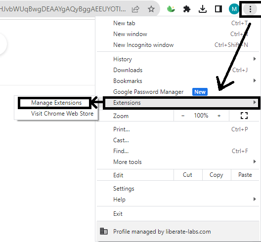
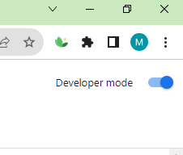
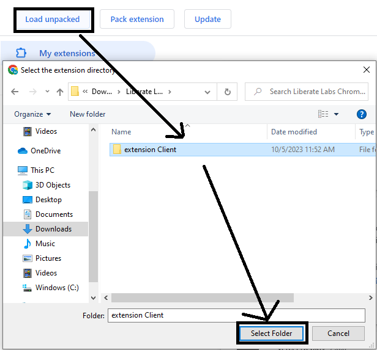
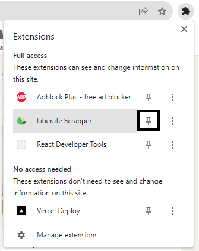
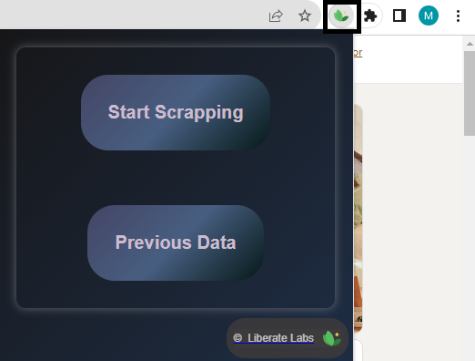

# Step-1: Clone the project


   ```javascript
git clone https://github.com/Liberate-Labs/outbounder-chrome-ext.git
```

<br>

# Step-2: Open Chrome Browser

<br>

# Step-3: Open manage chrome extension
   

   <br>

# Step-4: Enable Developer mode


<br>

# Step-5: Unpacked the extension folder



<br>

# Step-6: Pin the Extension



<br>

# Ready to use 

